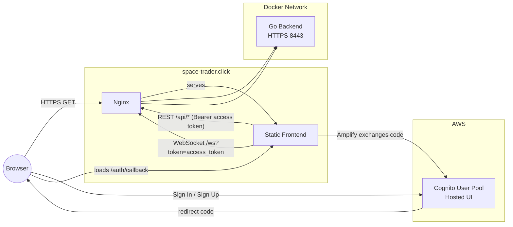

# Space Trading Simulation - AWS Cognito Integration

A real-time multiplayer space trading game with AWS Cognito authentication, API Gateway, and WebSocket support.

## Current Architecture (Cognito + Nginx + Go backend + Vite frontend)

The app is deployed as a small stack:

- Frontend: Vite + React, served by Nginx (static assets). Uses AWS Amplify Auth v6 with Cognito Hosted UI (Authorization Code + PKCE).
- Reverse Proxy: Nginx terminates TLS and proxies:
   - /api/* → backend HTTPS (8443 inside the Docker network)
   - /ws → backend WebSocket endpoint, with Upgrade headers
   - /health served from Nginx for external checks
- Backend: Go server provides REST endpoints and a WebSocket game server. Validates Cognito Access Tokens (JWT) for protected REST calls and WebSocket connections.
- Identity: AWS Cognito User Pool, App Client and Domain handle OAuth; Terraform provisions resources.

### High-level diagram



Notes:
- OAuth callback is https://space-trader.click/auth/callback.
- Tokens are exchanged/stored by Amplify; REST and WebSocket connections use the access token (JWT) for auth.

## How the flows work

### Sign In / Sign Up
1) Click “Sign In / Sign Up”.
2) Frontend calls Amplify signInWithRedirect() → Cognito Hosted UI.
3) After authentication, Cognito redirects back to /auth/callback.
4) Frontend calls fetchAuthSession() to exchange the code for tokens and stores the session.
5) UI updates to authenticated state.

### Launch Mission (WebSocket)
1) Frontend requests an access token via fetchAuthSession().
2) It opens wss://space-trader.click/ws?token=ACCESS_TOKEN.
3) Backend validates the token (Cognito JWKS) and registers the player.

### REST API
- All /api/* routes require Authorization: Bearer ACCESS_TOKEN.

## Local development

Prereqs: Node 18+, Go 1.22, Docker (optional).

- Dev frontend:
   - cd frontend
   - npm ci
   - npm run dev

Backend:
- cd backend
- go run ./cmd/server

Docker (full stack):
- docker compose up -d --build

## Environment

Frontend (.env.production):
- VITE_USE_AWS_AUTH=true
- VITE_AWS_REGION=us-east-1
- VITE_COGNITO_USER_POOL_ID=...
- VITE_COGNITO_CLIENT_ID=...
- VITE_COGNITO_IDENTITY_POOL_ID=...
- VITE_COGNITO_DOMAIN=space-trading-sim-....auth.us-east-1.amazoncognito.com
- VITE_COGNITO_CALLBACK_URL=https://space-trader.click/auth/callback
- VITE_COGNITO_LOGOUT_URL=https://space-trader.click/

Backend env (docker-compose.yml):
- AWS_REGION
- COGNITO_USER_POOL_ID
- COGNITO_CLIENT_ID
- COGNITO_DOMAIN
- COGNITO_CALLBACK_URL
- COGNITO_LOGOUT_URL

## Operational notes

- Nginx proxies /ws to backend over HTTPS with Upgrade headers and long timeouts.
- Health endpoints:
   - Nginx: GET /health → 200
   - Backend: GET /health (HTTP on 8080 for internal checks; HTTPS 8443 for external)
- Certificates managed via certbot containers (optional).

## Troubleshooting

- Hosted UI returns but app doesn’t sign in:
   - Ensure oauth.scopes are set and redirectSignIn/redirectSignOut are arrays.
   - Verify callback URL in Cognito app client matches.
   - Confirm bundle built with VITE_USE_AWS_AUTH=true and the right VITE_* values.
- WebSocket won’t connect:
   - Check endpoint is wss://space-trader.click/ws (not API Gateway).
   - Verify token query parameter is present and valid.
## 🚀 Features

- **AWS Cognito Authentication** - Secure user registration and login
- **Real-time Multiplayer** - WebSocket-based game communication
- **API Gateway Integration** - RESTful APIs and WebSocket routing
- **Terraform Infrastructure** - Complete infrastructure as code
- **Cross-platform** - Web-based game accessible anywhere
- **Responsive Design** - Works on desktop and mobile devices

## 🏗️ Architecture

```
┌─────────────────┐    ┌──────────────────┐    ┌─────────────────┐
│   Frontend      │────│   API Gateway    │────│    Backend      │
│   (React)       │    │   (REST + WS)    │    │   (Go Server)   │
└─────────────────┘    └──────────────────┘    └─────────────────┘
         │                        │                        │
         │                        │                        │
         │              ┌──────────────────┐               │
         └──────────────│  AWS Cognito     │───────────────┘
                        │  (Authentication)│
                        └──────────────────┘
```

## 📋 Prerequisites

- **Node.js** (v18 or later)
- **Go** (v1.22 or later)
- **Terraform** (v1.0 or later)
- **AWS CLI** (configured with appropriate permissions)
- **Docker** (optional, for containerized deployment)

## 🚀 Quick Start

### 1. Clone and Deploy

```bash
git clone <repository-url>
cd Game-SpaceTradingSim
./deploy-aws.sh
```

The deployment script will:
- Deploy AWS infrastructure using Terraform
- Generate frontend configuration from AWS outputs
- Install dependencies for both frontend and backend
- Build both applications

### 2. Manual Setup (Alternative)

If you prefer manual setup or need to customize the deployment:

#### Deploy AWS Infrastructure

```bash
cd terraform
cp terraform.tfvars.example terraform.tfvars
# Edit terraform.tfvars with your values
terraform init
terraform plan
terraform apply
```

#### Configure Frontend

```bash
cd frontend
cp .env.example .env.local
# Update .env.local with Terraform outputs
npm install
npm run dev
```

#### Configure Backend

```bash
cd backend
# Set environment variables from Terraform outputs
export AWS_REGION=us-east-1
export COGNITO_USER_POOL_ID=us-east-1_XXXXXXXXX
export COGNITO_CLIENT_ID=xxxxxxxxxxxxxxxxxxxxxxxxxx

go mod tidy
go run cmd/server/main.go
```

## 🔧 Configuration

### Environment Variables

#### Frontend (.env.local)
```env
VITE_AWS_REGION=us-east-1
VITE_COGNITO_USER_POOL_ID=us-east-1_XXXXXXXXX
VITE_COGNITO_CLIENT_ID=xxxxxxxxxxxxxxxxxxxxxxxxxx
VITE_COGNITO_IDENTITY_POOL_ID=us-east-1:xxxxxxxx-xxxx-xxxx-xxxx-xxxxxxxxxxxx
VITE_API_GATEWAY_URL=https://xxxxxxxxxx.execute-api.us-east-1.amazonaws.com/dev
VITE_WEBSOCKET_URL=wss://xxxxxxxxxx.execute-api.us-east-1.amazonaws.com/dev
VITE_COGNITO_DOMAIN=https://space-trading-sim-dev-xxxxxxxx.auth.us-east-1.amazoncognito.com
```

#### Backend
```bash
export AWS_REGION=us-east-1
export COGNITO_USER_POOL_ID=us-east-1_XXXXXXXXX
export COGNITO_CLIENT_ID=xxxxxxxxxxxxxxxxxxxxxxxxxx
```

### Terraform Variables

Key variables in `terraform/terraform.tfvars`:

```hcl
aws_region = "us-east-1"
project_name = "space-trading-sim"
environment = "dev"

cognito_callback_urls = [
  "http://localhost:5173",
  "https://your-domain.com"
]

cognito_logout_urls = [
  "http://localhost:5173",
  "https://your-domain.com"
]

# Enable for ECS deployment
enable_ecs = false
```

## 🎮 How to Play

1. **Sign Up/Sign In** - Create an account or sign in with existing credentials
2. **Enter Commander Name** - Choose your space trader identity
3. **Join/Create Room** - Join an existing game or create a new one
4. **Start Trading** - Buy low, sell high, and build your fortune
5. **Navigate Space** - Travel between planets using fuel
6. **Compete** - Compete with other players in real-time

## 🏭 Production Deployment

### ECS Deployment (Optional)

To deploy using AWS ECS:

1. Enable ECS in Terraform:
   ```hcl
   enable_ecs = true
   ```

2. Build and push Docker image:
   ```bash
   # Get ECR login
   aws ecr get-login-password --region us-east-1 | docker login --username AWS --password-stdin <account-id>.dkr.ecr.us-east-1.amazonaws.com
   
   # Build and push backend
   cd backend
   docker build -t space-trading-sim-backend .
   docker tag space-trading-sim-backend:latest <account-id>.dkr.ecr.us-east-1.amazonaws.com/space-trading-sim-dev-backend:latest
   docker push <account-id>.dkr.ecr.us-east-1.amazonaws.com/space-trading-sim-dev-backend:latest
   ```

### Frontend Deployment

For production frontend deployment, consider:

- **AWS S3 + CloudFront** - Static site hosting
- **Vercel/Netlify** - Automatic deployments
- **AWS Amplify** - Full-stack deployment

Update the Cognito callback URLs to include your production domain.

## 🔒 Security

- JWT token validation for all API endpoints
- WebSocket authentication using query parameters
- CORS configuration for cross-origin requests
- IAM roles with least privilege principles
- VPC integration (optional for enhanced security)

## 🛠️ Development

### Local Development

1. **Backend** (without AWS):
   ```bash
   cd backend
   go run cmd/server/main.go
   ```

2. **Frontend** (development mode):
   ```bash
   cd frontend
   npm run dev
   ```

### Testing Authentication

You can test the Cognito integration by:
1. Registering a new user
2. Checking email for verification code
3. Confirming registration
4. Signing in and accessing the game

## 📊 Monitoring

The infrastructure includes CloudWatch integration for:
- API Gateway request logs
- WebSocket connection metrics
- Application logs (when using ECS)
- Error tracking and alarms

## 🧹 Cleanup

To destroy all AWS resources:

```bash
cd terraform
terraform destroy
```

**⚠️ Warning**: This will permanently delete all AWS resources created by Terraform.

## 🔧 Troubleshooting

### Common Issues

1. **Certificate Errors in Development**
   - Visit the HTTPS endpoint directly to accept the certificate
   - Use Chrome's flag: `--ignore-certificate-errors-spki-list`

2. **WebSocket Connection Failed**
   - Check if the backend server is running
   - Verify the WebSocket URL in frontend configuration
   - Ensure authentication token is valid

3. **Cognito Authentication Errors**
   - Verify User Pool ID and Client ID
   - Check if callback URLs are correctly configured
   - Ensure email verification is completed

4. **CORS Issues**
   - Verify API Gateway CORS configuration
   - Check frontend origin in Cognito settings

### Debug Mode

Enable debug logging by setting environment variables:

```bash
# Backend
export LOG_LEVEL=debug

# Frontend (in .env.local)
VITE_DEBUG=true
```

## 📝 API Documentation

### WebSocket Events

- `connect` - Establish game connection
- `listRooms` - Get available game rooms
- `createRoom` - Create a new game room
- `joinRoom` - Join an existing room
- `startGame` - Start the game (room creator only)
- `selectPlanet` - Travel to a planet
- `buy` - Purchase goods
- `sell` - Sell goods

### REST Endpoints

- `GET /api/profile` - Get user profile
- `GET /api/rooms` - List game rooms
- `POST /api/rooms` - Create new room

## 🤝 Contributing

1. Fork the repository
2. Create a feature branch
3. Make your changes
4. Test thoroughly
5. Submit a pull request

## 📄 License

This project is licensed under the MIT License - see the LICENSE file for details.

## 🆘 Support

For issues and questions:
1. Check the troubleshooting section
2. Review AWS CloudWatch logs
3. Check GitHub issues
4. Create a new issue with detailed information

---

Built with ❤️ using React, Go, AWS Cognito, and Terraform.
